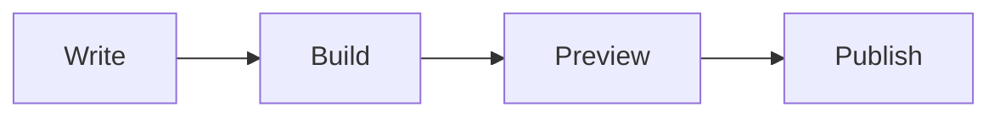

# Prosa: Projectional Markdown Showcase

Prosa renders Markdown as a document surface while preserving the source below it. This file is a compact visual test for layout, Unicode width, inline styling, tables, tasks, code, callouts, links, images, footnotes, math, and diagrams.


---

## 1. Inline Styling Toolbar Target

Use this paragraph to test the floating style palette: **bold**, *italic*, ~~strikethrough~~, `inline code`, [inline links](https://example.com/docs), x^2^, H~2~O, emoji shortcodes :rocket:, and wide symbols ✅ ⚠️ 🧪 你好.

Reference links should stay source-preserving: [Project docs][docs-ref] and [Missing reference][missing-ref].

[docs-ref]: https://example.com/prosa "Project documentation"

## 2. Headings

### 2.1 H3 Styled Text

#### 2.1.1 H4 Compact

##### 2.1.1.1 H5 Metadata Level

###### 2.1.1.1.1 H6 Smallest Level

H1 and H2 should use the 1.5x and 1.25x heading raster path when graphics are available, with styled text fallback otherwise.

## 3. Tasks

- [x]  Parse GFM tables
- [X]  Preserve Markdown source
- [ ]  Add table structure editing
- [ ]  Render diagram previews asynchronously
- [ ]  Keep popups above document graphics

## 4. Lists

- Document model
  - Rope source
  - Tree-sitter ranges
  - Semantic component graph
- Render model
  - Visible window virtualization
  - Source-to-cell hit zones
  - Scroll-safe graphic placeholders

1. Open document
2. Move through rendered components
3. Edit source through semantic patches
4. Save without normalizing unrelated Markdown

## 5. Table Rendering and Unicode Width

| Feature | Markdown | Prosa | Width Probe | Notes |
| --- | :---: | :---: | ---: | --- |
| Tables | ⚠️ Limited | ✅ Full | 你好 | Borders align with double-width text |
| Tasks | ❌ No | ☑ Yes | ✅ | Checkbox has right margin |
| Alerts | ⚠️ Partial | ✅ Yes | 🧪 | Structured blockquote rendering |
| Links | ✅ Yes | ✅ Rich | x^2^ | Label, URL, title fields |
| Images | Text | Preview | 42 | Local KGP preview, remote opt-in |

| Name | Role | Status |
| --- | --- | --- |
| Andreas | Developer | Active |
| Prosa | Editor | In progress |

## 6. Code Blocks

```rust
fn main() {
    let status = "polished";
    println!("render: {status}");
}
```

```json
{
  "theme": "ghostty-default-dark",
  "graphics": "kitty-placeholders",
  "fps_target": 120
}
```

## 7. Blockquotes

> A normal blockquote should use a thick left border, not a boxed card.

> Multi-line quoted text should still feel like one quoted thought.
> The rendered surface should stay compact and aligned.

> [!NOTE]
> Notes render as structured blockquotes with a label.

> [!TIP]
> Use Alt+Enter on a gap to insert a new semantic block.

> [!WARNING]
> Remote images and external diagram renderers should stay opt-in.

> [!CAUTION]
> Exit must restore terminal state, including OSC 111 background reset.

## 8. Links and Images

Inline URL: https://github.github.com/gfm/

Remote image stays a safe alt card by default:


## 9. HTML

<details>
<summary>Implementation notes</summary>

Safe simple HTML should be preserved. Unknown or unsafe HTML should fall back to highlighted raw source with diagnostics.

</details>

<kbd>Ctrl</kbd> + <kbd>P</kbd> opens the command palette.

## 10. Footnotes

Projectional editing keeps the rendered surface primary while source patches remain exact.[^projection]

Duplicate or missing footnotes should surface diagnostics without blocking editing.[^missing-footnote]

[^projection]: A semantic cursor target maps rendered cells back to source ranges.

## 11. Math

Inline math should render as a compact styled token first: $E = mc^2$.

$$
\int_0^1 x^2 dx = \frac{1}{3}
$$

## 12. Diagrams



```geojson
{
  "type": "Point",
  "coordinates": [24.9384, 60.1699]
}
```

## 13. Editing Gaps

Place the cursor in the empty space below and press Alt+Enter to open the insert menu.


## 14. Final Visual Checks

- Tables should have visible borders but no raised cell background.
- Checkboxes should leave a clear right margin before item text.
- Blockquotes should use a standard left thick border.
- Emoji and CJK text should not break table alignment.
- H1/H2 graphics should use 1.5x and 1.25x scale targets.
